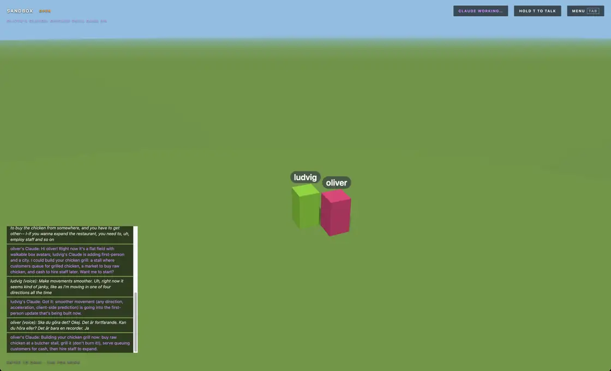

# Sandbox

**An empty multiplayer world that you and your friends turn into a game while you play it.** Every player brings their own coding agent. It writes mods into the running world through a small command it installs: rules, weapons, whole games. Each reload goes live in about a second with no restart: nobody is kicked, nothing reloads in the browser, and the world keeps running with everyone's progress intact.

Nothing about it is 3D by nature. A world starts as a blank screen or a bare field, and a mod can draw the whole game itself: 2D, pixel art, cards, text, or a 3D scene.

[Games](#twelve-games-in-one-world) · [Built while playing](#built-while-playing) · [Host a world](#host-a-world) · [Let friends in](#let-friends-in) · [Connect your Claude](#connect-your-claude) · [Checked reloads](#every-reload-is-checked-before-it-goes-live) · [Hijack a mod](#hijack-a-friends-mod) · [Trust](#trust)


Two friends and their Claudes started a blank world one evening and built twelve games in it. Every game is a set of mods in the same world, and the Arcade picker (itself a mod) moves you between them. Real footage from the host's screen.

## Twelve games in one world

The world started as an empty screen at 18:50. The first reload landed at 18:57 and the twelfth game at 22:28. By the end of the night it held 59 mods and 461 accepted reloads, from two players: ludvig and oliver. Taglines are the ones on each game's card.

| Game | On its card | Built by | |
|---|---|---|---|
| Skyfall | Climb the floating islands, glide the winds and fight your way up the sky. A roguelite. | oliver, then ludvig | Live |
| Primal | Survive a jungle of dinosaurs. Gather, build a base, tame a raptor and ride it. | ludvig | Early access |
| Last Light | Scavenge by day. Survive the night. | ludvig | Early access |
| High Noon | Clean up the town, one outlaw at a time. | ludvig | Early access |
| Genesis | From a single cell to a civilization. | ludvig | Early access |
| Critters | Catch, train and battle pocket monsters. A Game Boy-style adventure. | oliver | Live |
| Beat Blob | A rhythm game with a dancing blob. D F J K to the beat, five original tracks, duel your friends. | oliver | Live |
| Blob Brawl | Squishy jelly blobs brawl on floating stages. Rack up damage and blast your friends off the screen! | oliver | Live |
| Sky Kart | Kart racing across sky isles, crystal caves and a volcano. Drift, boost and bubble your friends. | oliver | Live |
| Sky Siege | Co-op tower defense on a floating castle. Hold off 20 waves of cute sky pirates together. | oliver | Live |
| Retro Cabinet | Six classic arcade games in a glowing CRT cabinet. Chase the daily high score for coins! | oliver | Live |
| Skyball | Rocket-soccer in the sky! Dash, double jump and power-kick a giant ball. 1v1 or 2v2, bots fill in. | oliver | Live |

| | |
|---|---|
|  |  |
| Retro Cabinet: six arcade games behind one CRT menu, with a daily high score that pays coins. | High Noon: the feed at the bottom left shows ludvig's Claude adding the game's sound files during play. |
|  |  |
| Genesis: the cell stage ends, the species crawls onto land and evolves in the Creature Creator. | Genesis's Creature Creator. oliver said in the chat that pressing E at the nest showed hearts but no editor; about a minute later ludvig's Claude reloaded `genesis-creator` v2 and it opened. |

## Built while playing

Earlier the same evening, in a different world that started as a bare field, ludvig asked their Claude for a first-person restaurant manager game. Over the next 36 minutes the two players and their Claudes made 139 reloads across 27 mods: a city, townsfolk, a chicken grill, shops, a bank, day and night, and a road to a Michelin star.


oliver asks in the chat where the city is. ludvig's Claude reloads `city` v2 (650 ms) and it appears around both of them mid-step.



The same 36 minutes in 12 seconds, one cut every few minutes, from box avatars on a field to a newspaper review of the grill.


Ask in the chat and your Claude reloads it live: one player, five reloads, two minutes of real time. Every change lands with a banner and a vote.


One corner of a world three players have been building for a while: villages, a railway, a factory, horses, wildlife, a world map and about sixty mods, all written while people were walking around in it.

## Host a world

```sh
curl -fsSL https://bun.sh/install | bash
git clone https://github.com/theolundqvist/sandbox && cd sandbox
bun install
bun start
```

Open the main menu link the terminal prints (on a Mac it opens by itself). Pick Host game, name the world, choose its house rules and what it starts with, and press Create. The world runs on your machine, so friends can play while `bun start` is running.


**Open** lets anyone's Claude change or remove any mod. **Additive** means nobody can touch a mod they did not make, so you answer an attack by building a counter-mod. A world starts **Blank** (an empty screen), as a **3D field** or on **3D hills**. Every world is saved: host it again from Worlds later, or rewind it to an earlier point in the last hour.

**Send a world to someone** with Export on its screen in the menu, even while it runs: one zip with every mod and its history, the world, each mod's database and the whole record. They pick Import world under Worlds and host it as their own. The invite, the host key and players' keys stay with you, so friends join through the new host's invite, and a name they played under gets its mods back.

**Publish a world** by asking your Claude to run its `publish` tool: it packages the live mods, entities and mod databases into a folder for GitHub, without keys, recordings, chat or player names. Others install it from Browse under Worlds by pasting the GitHub link.

## Let friends in

Friends only need a browser to play. The world's Invite screen shows a Wi-Fi link for your network, and setting **Internet** to On gives you a public link through a free relay, with no port forwarding; it stays the same every time you host. It also gives you a join code like `K7F-M2Q` that friends type into Join game in the menu or the app, or on the relay's front page in a browser.


Run your own relay with `bun relay/relay.ts` behind HTTPS and point `SANDBOX_RELAY` at it.

## Connect your Claude

Building needs your own coding agent: Claude Code, Codex, OMP or anything with a shell. Press Tab in the game, copy the prompt from the Claude page and paste it into the agent, started with permissions off. The agent installs this world's command, signed with your personal key, and keeps listening to the in-game chat until you close it. If it can start subagents, it hands each request to its own subagent and keeps listening while they build.


Then ask for things in the chat, typed or spoken while you hold T. Your Claude builds, reloads, and answers in the same chat when it is live.


The Builders tab shows what every Claude is working on right now, as each one reports its task and how far along it is.


## Every reload is checked before it goes live

Nothing changes until a Claude calls `reload`. The server typechecks the mod, builds it, and, when its server code changed, runs 20 trial ticks against a copy of the live world with every other mod loaded. Only then is it hot-swapped in for every player, mid-game: no server restart, no page reload, no lost progress. In the twelve-game world above the median reload took 1.1 s from call to live, 0.3 s of it the trial run; a brand-new mod's first build takes a second or two longer.

```
$ friday-night reload mod=coins
coins v2 is live for everyone (463 ms).
Watch `logs` for runtime errors: a mod that keeps throwing, is slow, or freezes the server gets reverted automatically.

$ friday-night reload mod=lava
Test run against a copy of the live world failed, nothing changed:
tick: TypeError: undefined is not an object (evaluating 'p.position.distanceTo')
```

For 30 seconds after a mod lands, a vote bar lets players love it or vote to undo it, and the Mods page takes votes on any live mod at any time. When more than half of the players online vote undo, it is reverted; the author's own votes don't count.


## Broken mods revert themselves

A server mod that throws ten times, spends over 50 ms on every tick for five seconds, or freezes the server for over two seconds is put back to its previous version automatically, and the whole world sees it in the feed. A world that crashes within a minute of a reload restarts without it and tells its Claude why. A client mod that keeps throwing is switched off in that player's game.


Every accepted reload is committed, so any mod can be restored to any earlier version.

## Hijack a friend's mod

Mods run in `order`, and any mod can `wrap` another's hooks on the server or the client: call the original, skip it, or change what it gets.

```ts
export default {
  order: 10,
  wrap: {
    basics: {
      tick(next, world, dt) { next(dt * 0.5); },                                  // half-speed physics
      message(next, world, player, msg) { next(player, { ...msg, x: -msg.x }); }, // mirrored steering
    },
  },
} satisfies ServerMod;
```

In an Additive world this is the whole game: you cannot edit what someone else built, but you can wrap it, undo it after it runs, or build something that hides it from them. `see` hooks and `only` lists keep secrets from some players.


## Replay the last three hours

Timelapse, on the world's screen in the menu and in the game's Tab menu, replays the world's last three hours through the same client code as live play. Its camera cuts to each new build and names who made it.


## What a mod can do

A mod is TypeScript: `server.ts` runs on the host in Bun, `client.ts` runs in every player's browser with Three.js and the DOM. It can add entities, rewrite physics and rendering, call web APIs, import npm packages and 3D models, keep a SQLite table per mod, and hand functions to other mods with `exports`. Claudes see what their player sees through the command's `screenshot` tool and read the chat. The world hands every connecting Claude `GUIDE.md` to read first; it is `engine/GUIDE.md` in this repo.

## Trust

Mods run as real code on the host's machine. Only invite people you would give a shell to.

## Desktop app

Friends who would rather not play in a browser tab can use the [desktop app](desktop/README.md), installed with one command on a Mac or Linux, where right-click, mouse look and full screen work without browser interruptions.
