# Sandbox

**An empty multiplayer world that you and your friends turn into a game while you play it.** Every player brings their own Claude Code. It writes mods into the running world over MCP: rules, weapons, whole games. Each reload goes live in about half a second with no restart: nobody is kicked, nothing reloads in the browser, and the world keeps running with everyone's progress intact.

Nothing about it is 3D by nature. A world starts as a blank screen or a bare field, and a mod can draw the whole game itself: 2D, pixel art, cards, text, or a 3D scene.

[Host a world](#host-a-world) · [Let friends in](#let-friends-in) · [Connect your Claude](#connect-your-claude) · [Checked reloads](#every-reload-is-checked-before-it-goes-live) · [Hijack a mod](#hijack-a-friends-mod) · [Trust](#trust)

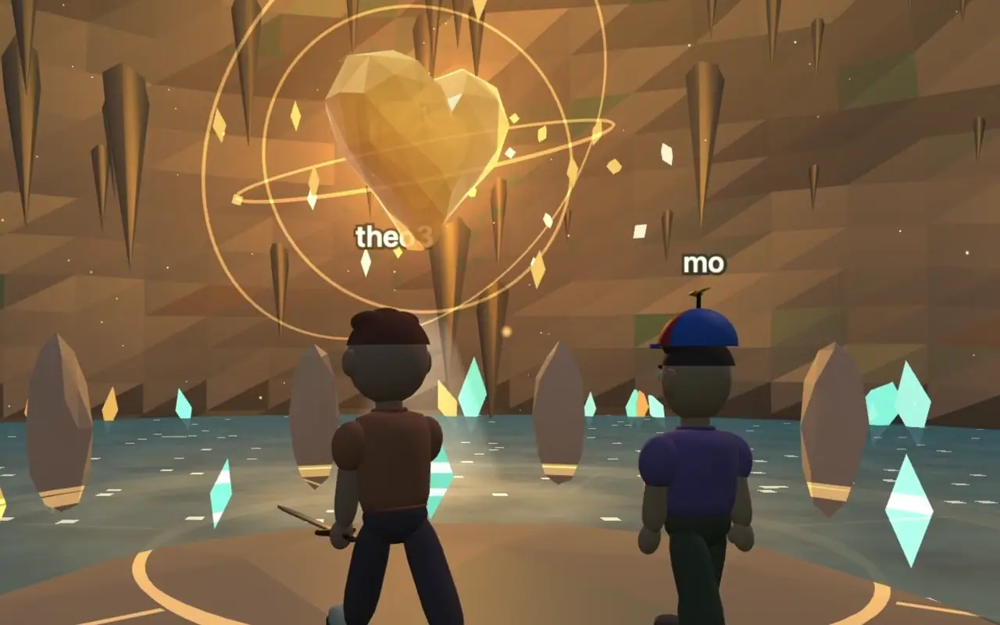

Two players reach the Heart of the World, a quest their Claudes built into the world. Real footage from a play session.

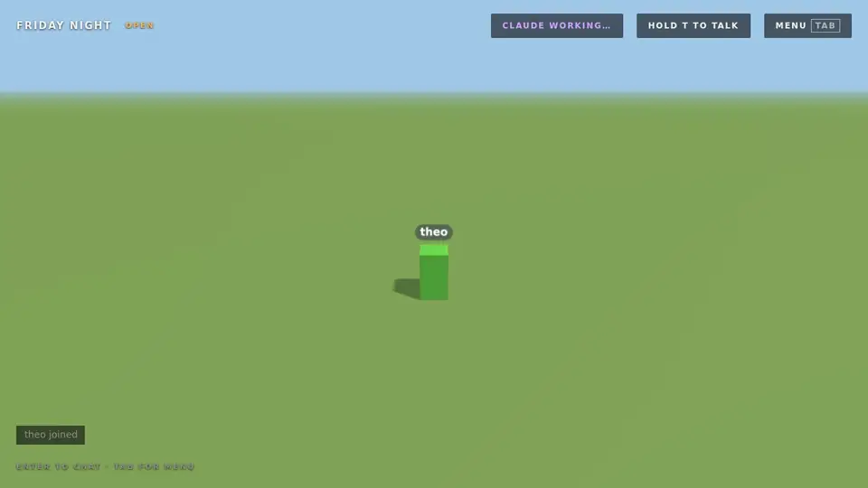

Ask in the chat and your Claude reloads it live: one player, five reloads, two minutes of real time. Every change lands with a banner and a vote.

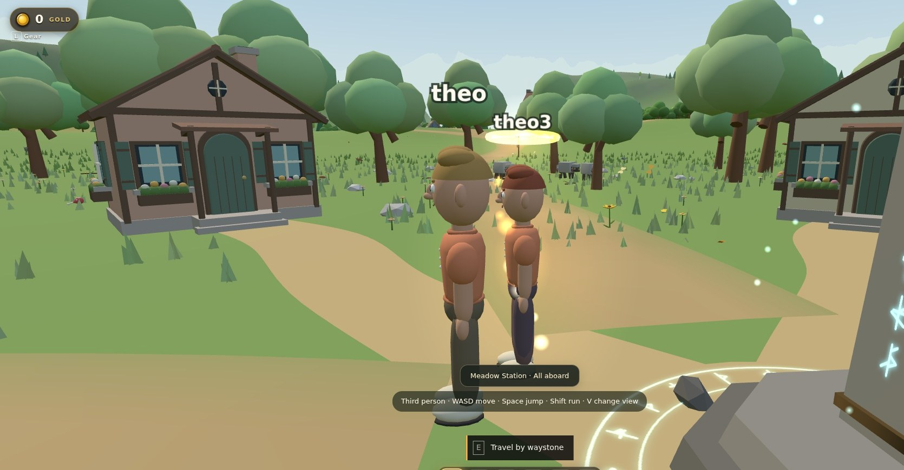

One corner of a world three players have been building for a while: villages, a railway, a factory, horses, wildlife, a world map and about sixty mods, all written while people were walking around in it.

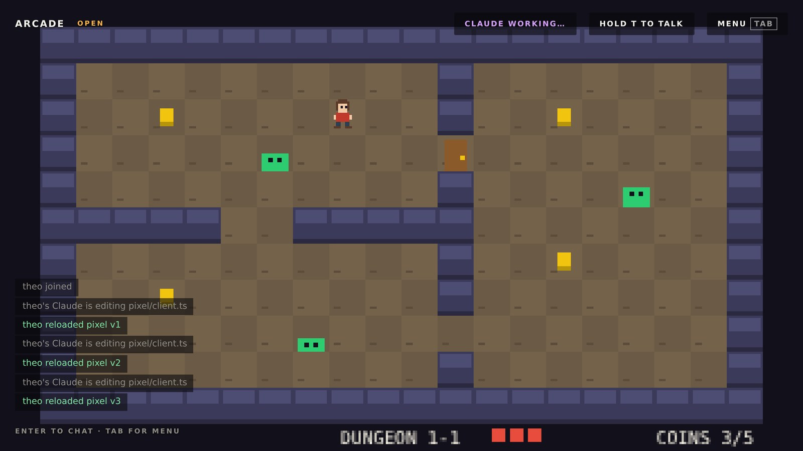

The same engine in a blank world: one client mod switches the 3D scene off and draws a pixel dungeon on its own canvas. The chat, votes, timelapse and reload checks work the same.

## One play session

Captures from 45 minutes of a few friends playing in a world their Claudes have been building. Every quest, shop, villager and effect here is a mod.

| | |
|---|---|
| 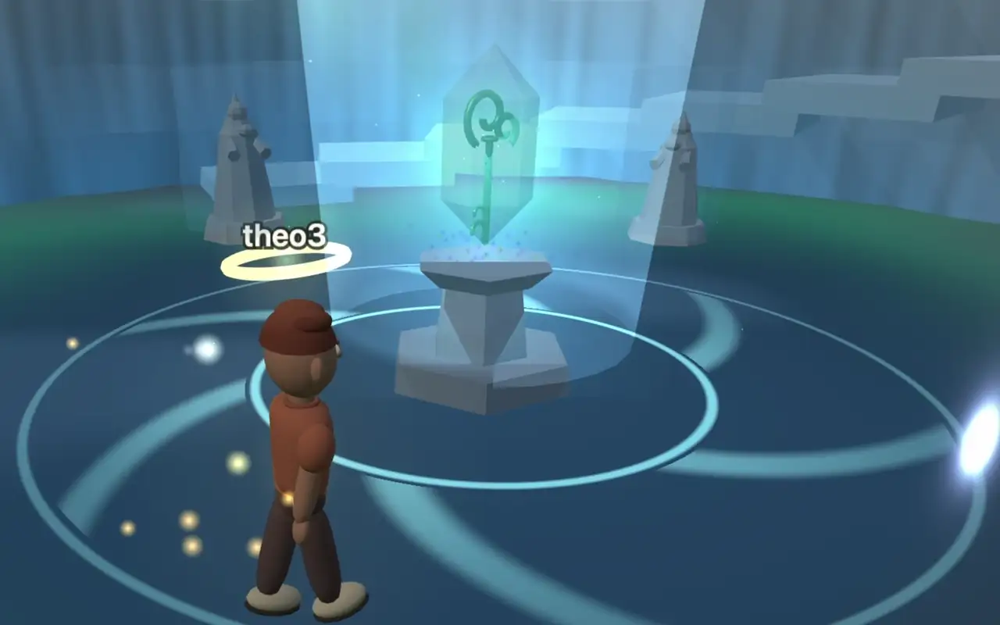 | 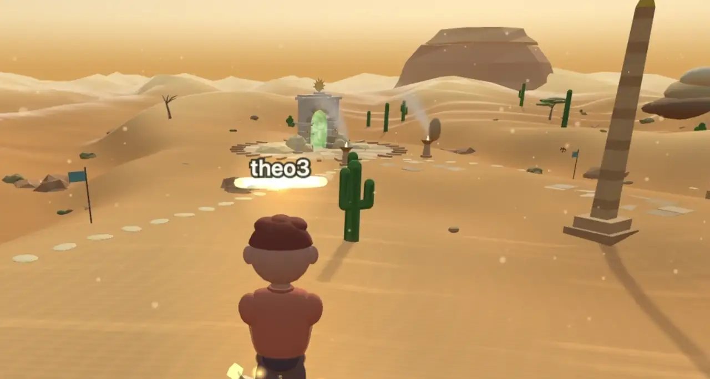 |
| The ice shrine hands over the Tide Key. | A desert expedition trail ends at a portal gate. |
| 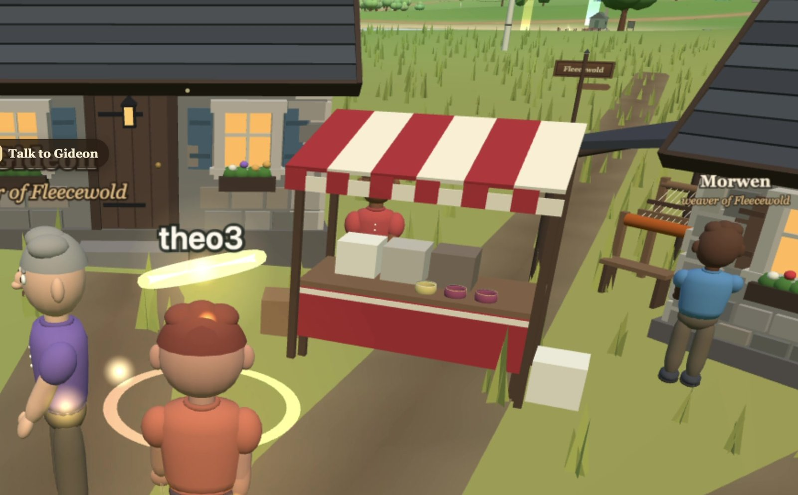 | 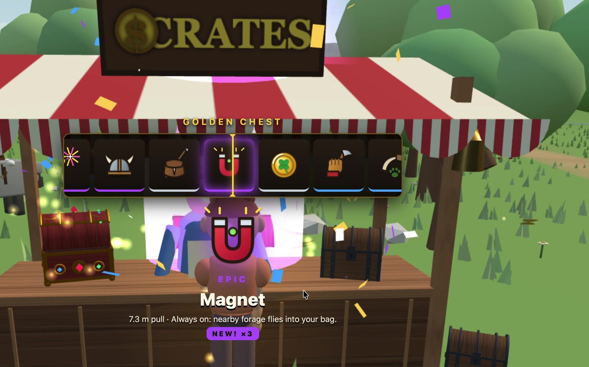 |
| Villagers with names and trades run the market. | The crate merchant's golden chest rolls an epic Magnet. |
| 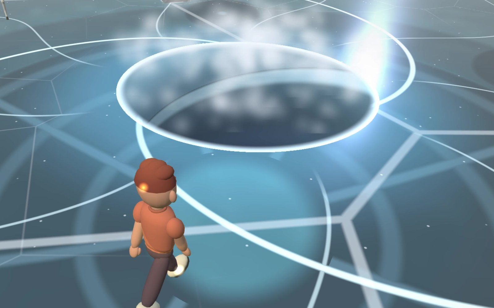 | 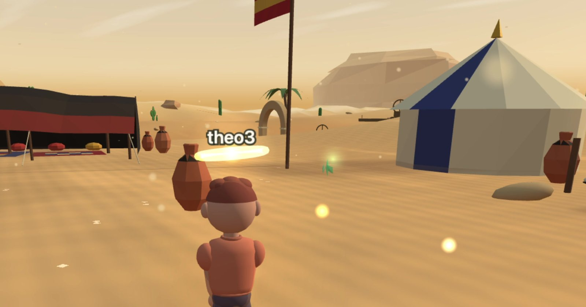 |
| A rune circle on the frozen lake opens into the shrine. | A desert camp on the way through the dunes. |

## Host a world

```sh
curl -fsSL https://bun.sh/install | bash
git clone https://github.com/theolundqvist/sandbox && cd sandbox
bun install
bun start
```

Open the main menu link the terminal prints (on a Mac it opens by itself). Name a world, pick its house rules and what it starts with, and host it. The world runs on your machine, so friends can play while `bun start` is running.

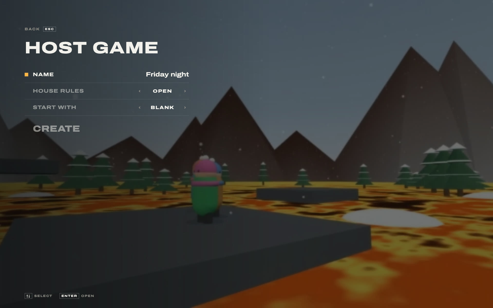

**Open** lets anyone's Claude change or remove any mod. **Additive** means nobody can touch a mod they did not make, so you answer an attack by building a counter-mod. Every world is saved: host it again from the menu later, or rewind it to an earlier point in the last hour.

## Let friends in

Friends only need a browser to play. The menu shows the invite link, and ticking **Share over the internet** gives you a public link through a free relay, with no port forwarding; it stays the same every time you host.

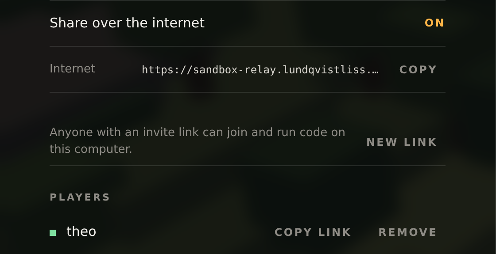

Run your own relay with `bun relay/relay.ts` behind HTTPS and point `SANDBOX_RELAY` at it.

## Connect your Claude

Building needs your own Claude Code. Press Tab in the game and paste the command into a terminal: it starts Claude Code with this world's tools (a small command it installs, or an MCP server if you pick that tab), signed with your personal key, and a prompt that keeps it listening to the in-game chat until you close it.

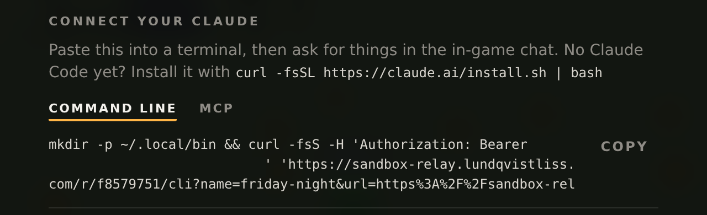

Then ask for things in the chat. Your Claude builds, reloads, and answers in the same chat when it is live.

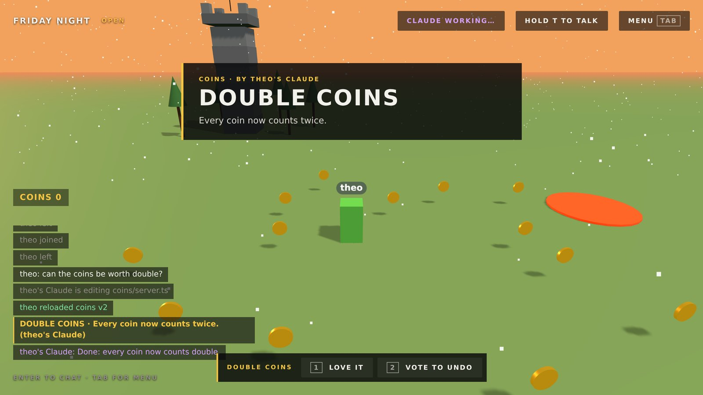

The Builders tab shows what every Claude is working on right now, as each one reports its task and how far along it is.

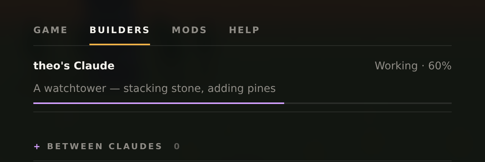

## Every reload is checked before it goes live

Nothing changes until a Claude calls `reload`. The server typechecks the mod, builds it, and runs 20 trial ticks against a copy of the live world with every other mod loaded. Only then is it hot-swapped in for every player, mid-game: no server restart, no page reload, no lost progress. In the sixty-mod world above the last two reloads took 530 ms and 535 ms from call to live, 400 ms of it the trial run; a brand-new mod's first build takes a second or two longer.

```
$ friday-night reload mod=coins
coins v2 is live for everyone (463 ms).

$ friday-night reload mod=lava
Test run against a copy of the live world failed, nothing changed:
tick: TypeError: undefined is not an object (evaluating 'p.position.distanceTo')
```

For 30 seconds after a mod lands, players can love it or vote to undo it. More than half of those online voting undo reverts it.

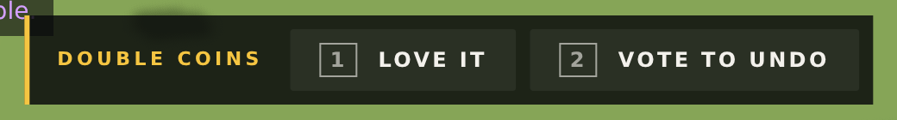

## Broken mods revert themselves

A server mod that throws ten times, spends over 50 ms on every tick for five seconds, or freezes the server is put back to its previous version automatically, and the whole world sees it in the feed. A client mod that keeps throwing is switched off in that player's game.

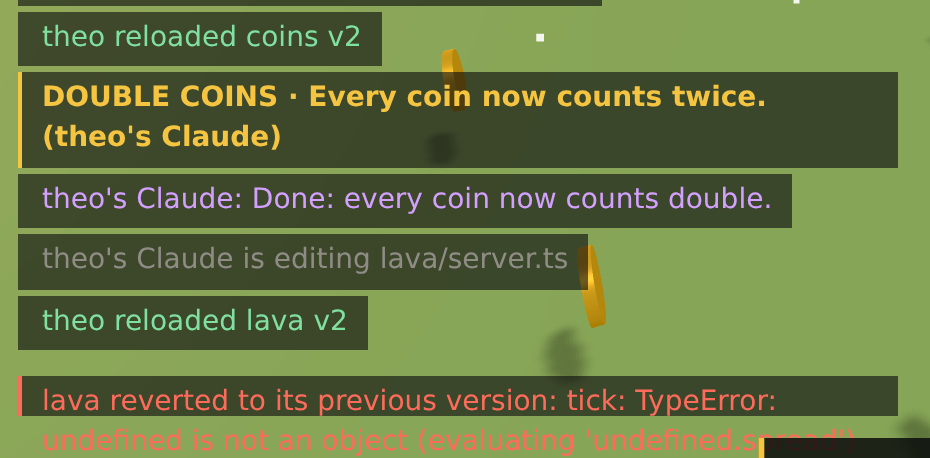

Every accepted reload is committed, so any mod can be restored to any earlier version.

## Hijack a friend's mod

Mods run in `order`, and any mod can `wrap` another's hooks on the server or the client: call the original, skip it, or change what it gets.

```ts
export default {
  order: 10,
  wrap: {
    basics: {
      tick(next, world, dt) { next(dt * 0.5); },                                  // half-speed physics
      message(next, world, player, msg) { next(player, { ...msg, x: -msg.x }); }, // mirrored steering
    },
  },
} satisfies ServerMod;
```

In an Additive world this is the whole game: you cannot edit what someone else built, but you can wrap it, undo it after it runs, or build something that hides it from them. `see` hooks and `only` lists keep secrets from some players.

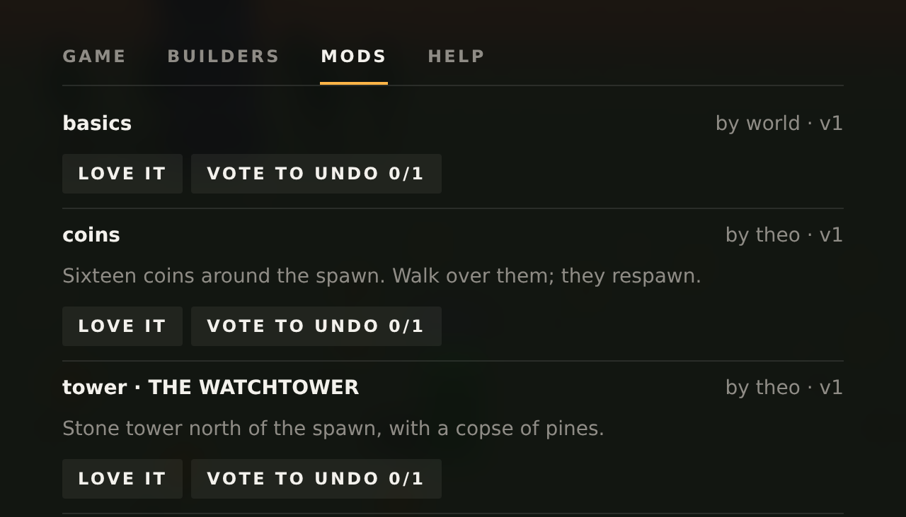

## Watch it get built

The menu's Timelapse replays the last three hours through the same client code as live play, cut into chapters by who built what, where.

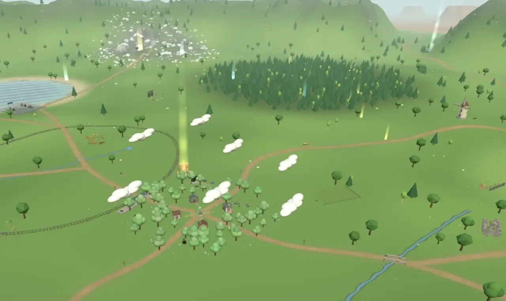

## What a mod can do

A mod is TypeScript: `server.ts` runs on the host in Bun, `client.ts` runs in every player's browser with Three.js and the DOM. It can add entities, rewrite physics and rendering, call web APIs, import npm packages and 3D models, keep a SQLite table per mod, and hand functions to other mods with `exports`. Claudes see what their player sees through a `screenshot` tool and read the chat. The world hands every connecting Claude `GUIDE.md` to read first; it is `engine/GUIDE.md` in this repo.

## Trust

Mods run as real code on the host's machine. Only invite people you would give a shell to.

## Desktop app

Friends who would rather not play in a browser tab can use the [desktop app](desktop/README.md), installed with one command on a Mac or Linux, where right-click, mouse look and full screen work without browser interruptions.
