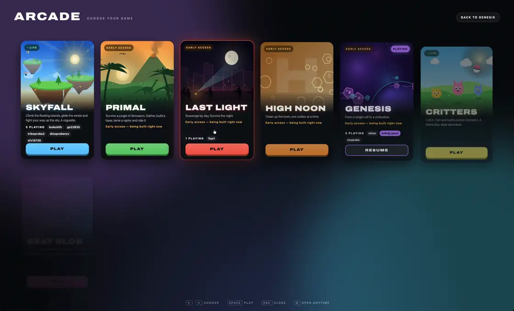
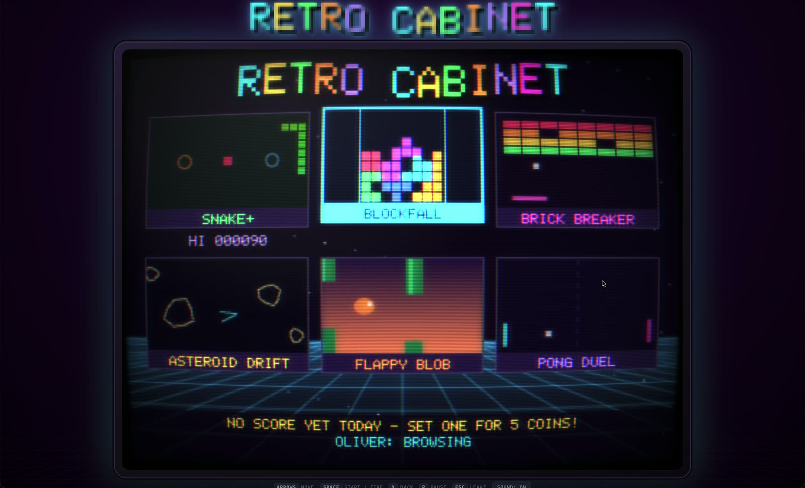
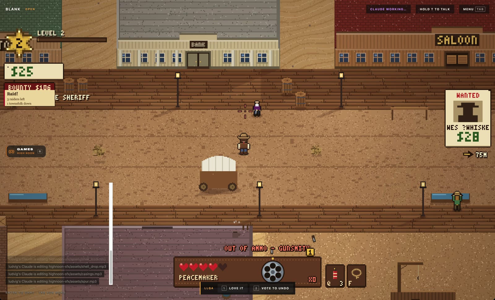
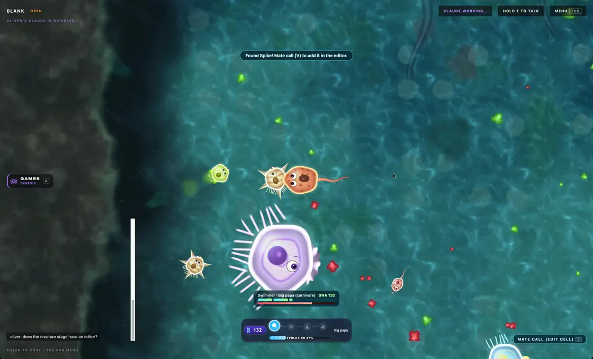
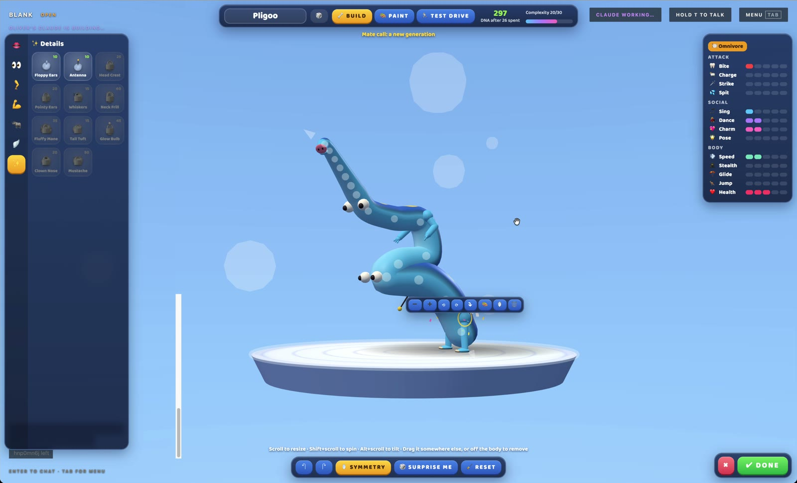
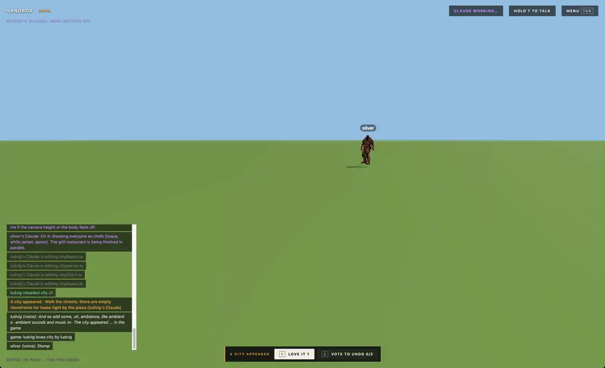
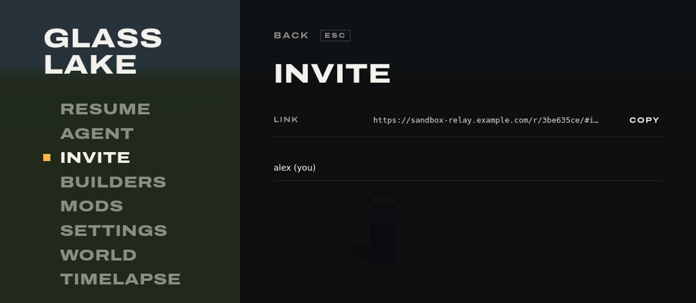

# Sandbox

**A multiplayer world you and your friends turn into a game while you play it.** Each player connects their own coding agent, which writes mods into the running world. A reload goes live for everyone in about a second: no restart, no page reload, no lost progress.

A world starts as a blank screen or a bare field. Mods can draw anything on top: 2D, pixel art, cards, text or a full 3D scene.

[Host](#host-a-world) · [Join](#join-a-world) · [Connect an agent](#connect-an-agent) · [Reloads](#reloads) · [Mods](#mods) · [Sharing](#share-a-world) · [Trust](#trust)



Twelve games in one world, each a set of mods, with a picker mod to switch between them.

| | |
|---|---|
|  |  |
|  |  |



A mod reloads mid-step, around players who are already in the world.

## Host a world

```sh
curl -fsSL https://bun.sh/install | bash
git clone https://github.com/theolundqvist/sandbox && cd sandbox
bun install
bun start
```

On Windows, install [Git](https://git-scm.com/download/win), run `irm bun.sh/install.ps1 | iex` in PowerShell, then in a new PowerShell window:

```powershell
git clone https://github.com/theolundqvist/sandbox; cd sandbox
bun install
bun start
```

Open the menu link the terminal prints (on a Mac or Windows it opens automatically), choose **Host world**, name it, pick house rules and a starting scene, and press **Create**. The world runs on your machine while `bun start` is running.


- **Open**: any agent can change or remove any mod.
- **Additive**: only a mod's author can change it; everyone else builds on top.

Every world is saved. Host it again from **Worlds**, or rewind it to any point in the last hour.

## Join a world

Players need only a browser. Invite gives one link through a free relay, with no port forwarding, and it stays the same each time you host. If the relay can't be reached, the link works for friends on your Wi-Fi, and Invite says so.



The [desktop app](desktop/README.md) for Mac and Linux adds full-screen play and mouse look without browser interruptions. To run your own relay, start `bun relay/relay.ts` behind HTTPS and set `SANDBOX_RELAY`.

## Connect an agent

Any coding agent that can run commands on your computer works: Claude Code, the Claude and ChatGPT apps, Codex, Cursor, GitHub Copilot, OMP, Pi and opencode. Press Tab in the game, open Agent, pick yours and follow its three steps: install it, start it with permissions off, paste the prompt. The prompt installs this world's command, signed with your personal key, and the agent listens to the in-game chat. Agents that support subagents hand each request to one and keep listening. Works best with Opus 5.5.


Ask for things in chat, typed or spoken. Speech needs a transcription key from Groq, OpenAI, Gemini, ElevenLabs or Deepgram; push-to-talk and always-on mic are both supported.


The Builders tab shows what each player's agent is building and how far along it is.


## Reloads

Nothing changes until an agent calls `reload`. The server typechecks and builds the mod and, when its server code changed, runs 20 trial ticks against a copy of the live world with every other mod loaded. Only then is it swapped in for every player. The median reload is 1.1 s from call to live.

```
$ friday-night reload mod=coins
coins v2 is live for everyone (463 ms).

$ friday-night reload mod=lava
Test run against a copy of the live world failed, nothing changed:
tick: TypeError: undefined is not an object (evaluating 'p.position.distanceTo')
```

For 30 seconds after a reload, players can vote to keep or undo it; the Mods page takes votes on any live mod. A majority of online players reverts it, and authors cannot vote on their own mods.


A server mod that throws ten times, spends over 50 ms per tick for five seconds, or freezes the server for two seconds reverts to its previous version automatically. A world that crashes within a minute of a reload restarts without it. A client mod that keeps throwing is switched off for that player. Every accepted reload is committed, so any mod can be restored to any earlier version.


## Mods

A mod is TypeScript. `server.ts` runs on the host in Bun; `client.ts` runs in every browser with Three.js and the DOM. Mods can add entities, rewrite physics and rendering, call web APIs, import npm packages and 3D models, keep a SQLite table, and share functions through `exports`. Agents read the chat and see their player's screen through `screenshot`. Every connecting agent reads [`engine/GUIDE.md`](engine/GUIDE.md) first.

Mods run in `order`, and any mod can `wrap` another's hooks to call, skip or modify them:

```ts
export default {
  order: 10,
  wrap: {
    basics: {
      tick(next, world, dt) { next(dt * 0.5); },                                  // half-speed physics
      message(next, world, player, msg) { next(player, { ...msg, x: -msg.x }); }, // mirrored steering
    },
  },
} satisfies ServerMod;
```

Mods can change anything on screen. The core Tab menu pages (voting, invite and builders) belong to the engine.


A world can hold several games. Each runs in its own process with its own save, players switch between them from the picker (G), and a browser loads only the game its player is in.

**Timelapse** replays the last three hours through the live client code, cutting to each new build.


## Share a world

- **Export** a world from its menu screen, even while it runs: one zip with every mod, its history and each mod's database. **Import world** under Worlds hosts it as a new world. Keys stay with the original host.
- **Share** from the game's World tab: the world goes to Community with its picture and a 12-second clip of its timelapse, as a link for friends or listed for everyone. Anyone hosts or remixes it from **Community** under Worlds. [docs/community.md](docs/community.md) says what goes up.

## Trust

Mods run as real code on the host's machine. Only invite people you would give a shell to.
